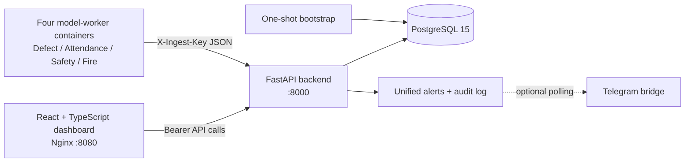

# Baseer — Smart Factory Operations Platform

Baseer (بصير) is a Python-first smart-factory operations platform for monitoring fabric quality, workforce attendance, PPE compliance, and fire/smoke alerts from one dashboard. It addresses the operational problem of separating camera/model outputs from the business workflows that supervisors need: persisted events, alert acknowledgement, employee self-service, payroll calculations, and Excel reporting.

> **Honest implementation status:** the platform and model-ingestion contracts are implemented, but the four included model workers are scaffolds that currently emit synthetic events. They are not trained or evaluated production models. The repository does not claim dataset, accuracy, or performance results that are not present.

## Key capabilities

The backend provides role-aware authentication, employee records, payroll computation from attendance and adjustments, fabric inspection statistics, attendance event storage, PPE compliance logs with persistent three-strike deductions, fire/smoke alerting, a unified alert center, system-health summaries, and Excel exports. The React dashboard exposes these modules through manager pages and an employee self-service dashboard. An optional Telegram polling bridge can forward persisted alerts when configured separately.

## Architecture



The model workers never connect directly to PostgreSQL. They post validated JSON to `/ingest/*` using `BASEER_INGEST_KEY`; the API persists the event and creates any required alert or payroll side effect. The API owns schema creation and uses an `asyncpg` connection pool.

## Technology stack

| Layer | Technologies actually used |
|---|---|
| Backend | Python 3.11, FastAPI, Pydantic v2, Uvicorn |
| Data | PostgreSQL 15, asyncpg, SQL schema/index initialization |
| Frontend | React 18, TypeScript, Vite, React Router, TanStack Query, Tailwind CSS |
| Visualization | Chart.js and `react-chartjs-2` |
| Runtime | Docker Compose, Nginx |
| Optional integration | Telegram Bot API polling bridge |
| Reporting | `openpyxl` XLSX generation |

## AI/ML status and extension points

The four worker directories are intentionally isolated integration points:

| Worker | Current behavior | Intended production replacement |
|---|---|---|
| `models/defect/` | Synthetic defect/normal scaffold | Fabric anomaly or defect model plus image/overlay storage |
| `models/attendance/` | Synthetic employee in/out events | Camera pipeline with face-recognition enrolment and event folding |
| `models/safety/` | Synthetic PPE compliance | PPE detector such as a validated object-detection model |
| `models/fire/` | Synthetic rare fire/smoke events | Validated fire/smoke detector with camera evidence |

No dataset, training pipeline, model weights, evaluation split, or metrics are included in this source archive. Replace each worker's `detect()` implementation, add its real dependencies to `models/requirements.txt`, mount weights outside Git, and add model-specific evaluation before treating the result as production AI. The API currently provides the persistence and business-rule layer around those future model outputs.

## Project structure

```text
.
├── api/                 FastAPI routes, validation schemas, auth, payroll, ingestion
├── Database/            PostgreSQL schema, pool lifecycle, database helpers
├── bootstrap/           One-shot foundational employee and manager provisioning
├── dashboard/           React/Vite/TypeScript web client
├── integrations/telegram Optional alert polling bridge
├── models/              Four worker scaffolds and shared authenticated HTTP client
├── Docker/              Compose topology, Dockerfiles, Nginx, environment template
├── tests/               Focused unit and validation tests
├── Docker/.env.example  Safe configuration template
└── LICENSE              MIT license
```

## Installation and configuration

Docker and Docker Compose are the supported end-to-end runtime. From the repository root:

```bash
cd Docker
cp .env.example .env
```

Edit `.env` and replace every `CHANGE_ME` value. For example, generate strong values with:

```bash
openssl rand -hex 32   # BASEER_SECRET
openssl rand -hex 24   # BASEER_INGEST_KEY
openssl rand -base64 24 # database and bootstrap passwords
```

Set `BASEER_SECRET`, `BASEER_INGEST_KEY`, `POSTGRES_PASSWORD`, `BOOTSTRAP_MANAGER_PASSWORD`, and `BOOTSTRAP_EMPLOYEE_PASSWORD` before starting. `ALLOW_SELF_REGISTRATION=false` is the secure default; enable it only when the deployment is prepared for open employee enrolment. `CORS_ORIGINS` must contain only the dashboard origins that should call the API, separated by commas. Do not commit `.env`.

Start the stack with:

```bash
docker compose up -d --build
```

The dashboard is available at <http://localhost:8080>, the API root at <http://localhost:8000>, and interactive API documentation at <http://localhost:8000/docs>. The bootstrap container seeds foundational users once; it does not create operational event data. If it must be rerun after a failed first start, use `docker compose run --rm bootstrap`.

To pause the scaffold workers while integrating real models:

```bash
docker compose stop defect_model attendance_model safety_model fire_model
```

## Local tests and frontend build

The focused Python tests do not require Docker or PostgreSQL:

```bash
python3 -m venv .venv
. .venv/bin/activate
pip install -r api/requirements.txt -r bootstrap/requirements.txt pytest
PYTHONPATH=. pytest -q
```

The dashboard can be type-checked and bundled independently:

```bash
cd dashboard
pnpm install
pnpm run build
```

## API examples

Operational model workers must send the ingestion secret. This example creates a smoke alert:

```bash
curl -X POST http://localhost:8000/ingest/fire \
  -H "Content-Type: application/json" \
  -H "X-Ingest-Key: $BASEER_INGEST_KEY" \
  -d '{"alert_type":"smoke","confidence":0.91,"location":"خط الصباغة"}'
```

| Area | Important endpoints | Access |
|---|---|---|
| Authentication | `POST /auth/login`, `POST /auth/register`, `GET /auth/me` | Login/register policy; authenticated profile |
| Ingestion | `POST /ingest/defect`, `/attendance`, `/safety`, `/fire` | Worker key |
| Operations | `GET /overview/summary`, `/defects/*`, `/attendance/*`, `/safety/*`, `/fire/*` | Manager |
| Employees | `GET /employees`, `GET /employees/{id}`, `GET /me/dashboard` | Manager or own employee record |
| Payroll/settings | `GET /employees/{id}/salary`, `POST /employees/{id}/adjustments`, `GET/PUT /settings` | Manager or own salary read; manager for changes |
| Reports | `GET /reports/payroll`, `GET /reports/attendance` | Manager |

## Security notes

The API uses parameterized SQL, strict request validation, PBKDF2-HMAC-SHA256 password hashes with random salts, signed expiring tokens, explicit CORS origins, manager authorization on operational endpoints, and a shared secret for model ingestion. Existing legacy fixed-salt demo hashes remain verifiable to support migration; new passwords use the stronger format. A production deployment must provide a long `BASEER_SECRET`, must not reuse demo passwords, and should place the stack behind TLS and an appropriate network boundary.

## Limitations and future improvements

The current worker implementations are synthetic scaffolds, attendance folding from raw camera events into daily records is still a separate intended worker responsibility, and no camera capture, model weights, dataset, or evaluation report is included. The browser stores its session token in local storage because this is a client-rendered graduation-project dashboard; a production deployment should consider an HttpOnly cookie/session design. The existing overlay-image compatibility route accepts a token query parameter for image tags; prefer authenticated blob fetching or a short-lived signed asset URL when hardening the production UI further. Rate limiting, password reset, refresh-token rotation, migrations, structured logging, and automated integration tests against PostgreSQL are also appropriate next steps.

## License

Released under the [MIT License](LICENSE).
