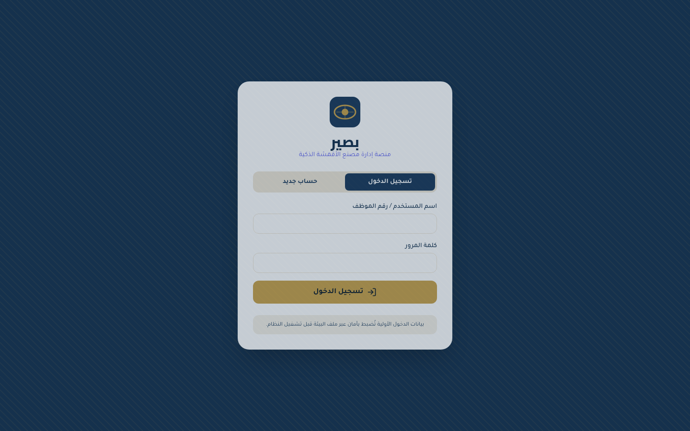
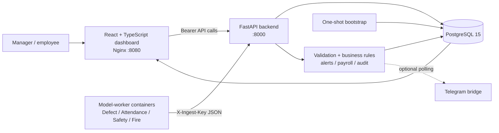

# Baseer — Smart Factory Operations Platform


Baseer (بصير) is a **smart-factory operations platform with AI/computer-vision model integration architecture**. It connects factory operations such as fabric-quality events, attendance, PPE compliance, fire/smoke alerts, payroll, and reporting through a Python-first backend and a React dashboard.



> **Honest implementation status:** the platform, database, dashboard, authentication, event ingestion, alerting, and model-worker integration architecture are implemented. The four included model workers are **synthetic scaffolds** that emit demo events; they are not trained production models. This repository contains no real dataset, model weights, accuracy/F1/mAP metrics, inference benchmark, or production-detection claim.

## What is implemented today

| Implemented capability | Evidence in the repository |
|---|---|
| Factory operations backend | FastAPI routes in `api/` with PostgreSQL persistence in `Database/` |
| Dashboard | React + TypeScript + Vite application in `dashboard/` |
| Authentication and authorization | Signed expiring tokens, manager checks, employee self-service boundaries |
| Event ingestion | Validated `/ingest/*` contracts protected by `X-Ingest-Key` |
| Operational rules | PPE three-strike deductions, alerts, payroll calculations, acknowledgements |
| Model integration architecture | Isolated worker containers that post structured events to FastAPI |
| Synthetic model-worker scaffolds | Defect, attendance, safety, and fire workers in `models/` |
| Deployment packaging | Docker Compose, PostgreSQL, Nginx, API/bootstrap/model Dockerfiles |

## What is not implemented yet

The published source does **not** include trained production computer-vision models, real datasets, model-training pipelines, evaluation metrics, inference benchmarks, or a camera deployment. Attendance ingestion stores raw events, while the downstream event-folding process that derives daily attendance records remains a future worker/service responsibility. These limitations are intentional and documented rather than hidden.

## Why the architecture is useful

The project separates **inference concerns** from **factory application concerns**. A future CV model can run in its own worker container, produce a structured event, authenticate to the platform, and reuse the existing persistence, alerting, payroll, and dashboard workflows without gaining direct database access.



## How AI models integrate with Baseer

The current workers use synthetic detection functions, but the integration path is real and intentionally narrow:

1. A model worker performs inference on a camera frame, image, or event source.
2. The worker produces a structured detection/event such as a defect result, attendance event, PPE state, or fire/smoke alert.
3. The worker authenticates with the shared `BASEER_INGEST_KEY` and sends JSON to the FastAPI ingestion endpoint.
4. FastAPI validates the payload and resolves any referenced employee or operational entity.
5. The backend stores the event in PostgreSQL.
6. Domain logic generates alerts, safety strikes, deductions, or other actions where applicable.
7. The dashboard queries the resulting data and presents it to a manager or employee.

Workers never connect directly to PostgreSQL. This keeps model code replaceable and prevents inference containers from owning business data or credentials.

## Synthetic demo path

The following flow uses **synthetic/demo data only**. It demonstrates the existing platform integration path; it does **not** represent real trained AI inference.

### 1. Configure and start the stack

```bash
cd Docker
cp .env.example .env
# Replace every CHANGE_ME value in .env.
docker compose up -d --build
```

The bootstrap service provisions the manager and employee accounts from environment variables. If the one-shot bootstrap needs to be rerun:

```bash
docker compose run --rm bootstrap
```

### 2. Send synthetic events through the authenticated ingestion boundary

From the repository root, after exporting the same ingestion key used in `Docker/.env`:

```bash
export BASEER_API_URL=http://localhost:8000
export BASEER_INGEST_KEY='your-configured-ingestion-key'
./scripts/demo_synthetic_events.sh
```

The script sends one synthetic event payload directly to each supported ingestion contract. It exercises the same authenticated API boundary used by the model-worker containers, without pretending to run trained inference. The expected platform path is:

> **Synthetic event payload → authenticated FastAPI ingestion → PostgreSQL → alert/business rule → dashboard refresh**

### 3. Inspect the result

Open <http://localhost:8080>, sign in with the bootstrap credentials configured in `.env`, and inspect the manager dashboard, defects, attendance, safety, fire, and alerts pages. Because Docker/PostgreSQL and authenticated runtime data are required, the repository includes an authentic login screenshot but does not fabricate dashboard screenshots or claim that the synthetic events came from trained models.

## Technology stack

| Layer | Technologies actually used |
|---|---|
| Backend | Python 3.11, FastAPI, Pydantic v2, Uvicorn |
| Data | PostgreSQL 15, asyncpg, SQL schema/index initialization |
| Frontend | React 18, TypeScript, Vite, React Router, TanStack Query, Tailwind CSS |
| Visualization | Chart.js and `react-chartjs-2` |
| Runtime | Docker Compose, Nginx |
| Optional integration | Telegram Bot API polling bridge |
| Reporting | `openpyxl` XLSX generation |
| CI | GitHub Actions for tests, compile/smoke checks, Compose validation, and frontend build |

## Project structure

```text
.
├── api/                 FastAPI routes, validation schemas, auth, payroll, ingestion
├── Database/            PostgreSQL schema, pool lifecycle, database helpers
├── bootstrap/           One-shot foundational employee and manager provisioning
├── dashboard/           React/Vite/TypeScript web client
├── integrations/telegram Optional alert polling bridge
├── models/              Four worker scaffolds and shared authenticated HTTP client
├── scripts/             Synthetic/demo event helpers
├── docs/assets/         Authentic project branding and captured login screenshot
├── Docker/              Compose topology, Dockerfiles, Nginx, environment template
├── tests/               Focused unit, schema, smoke, and Compose-validation tests
├── .github/workflows/   Project-specific continuous integration
├── Docker/.env.example  Safe configuration template
└── LICENSE              MIT license
```

## AI/ML worker status

| Worker | Current repository behavior | Future production replacement |
|---|---|---|
| `models/defect/` | Synthetic defect/normal events | Fabric anomaly/defect model with image and overlay handling |
| `models/attendance/` | Synthetic employee in/out events | Camera pipeline with recognition, deduplication, and event folding |
| `models/safety/` | Synthetic PPE compliance events | Validated PPE detector with class/confidence calibration |
| `models/fire/` | Synthetic rare fire/smoke events | Validated fire/smoke detector with camera evidence |

No model metrics are claimed because the source archive contains no training or evaluation artifacts. A future model contribution should include its data provenance, train/validation methodology, metrics, error analysis, model version, and reproducible inference instructions.

## Installation and configuration

Docker and Docker Compose are the supported end-to-end runtime. From the repository root:

```bash
cd Docker
cp .env.example .env
```

Edit `.env` and replace every `CHANGE_ME` value. Generate strong values with:

```bash
openssl rand -hex 32    # BASEER_SECRET
openssl rand -hex 24    # BASEER_INGEST_KEY
openssl rand -base64 24 # database and bootstrap passwords
```

Set `BASEER_SECRET`, `BASEER_INGEST_KEY`, `POSTGRES_PASSWORD`, `BOOTSTRAP_MANAGER_PASSWORD`, and `BOOTSTRAP_EMPLOYEE_PASSWORD` before starting. `ALLOW_SELF_REGISTRATION=false` is the secure default. `CORS_ORIGINS` should contain only allowed dashboard origins. Do not commit `.env`.

After startup, the dashboard is available at <http://localhost:8080>, the API root at <http://localhost:8000>, and interactive API documentation at <http://localhost:8000/docs>.

## Local validation

The focused Python tests do not require Docker or PostgreSQL:

```bash
python3 -m venv .venv
. .venv/bin/activate
pip install -r api/requirements.txt -r bootstrap/requirements.txt pytest PyYAML
PYTHONPATH=. pytest -q
python3 -m compileall -q Database api bootstrap integrations models tests
PYTHONPATH=. python3 tests/smoke_import.py
PYTHONPATH=. python3 tests/validate_compose.py
```

The dashboard can be type-checked and bundled independently:

```bash
cd dashboard
pnpm install --frozen-lockfile
pnpm run build
```

These same checks run in [GitHub Actions](.github/workflows/ci.yml) on pushes and pull requests.

## API documentation and examples

Operational model workers must send the ingestion secret. The demo helper provides a complete synthetic example; a single smoke request looks like this:

```bash
curl -X POST http://localhost:8000/ingest/fire \
  -H "Content-Type: application/json" \
  -H "X-Ingest-Key: $BASEER_INGEST_KEY" \
  -d '{"alert_type":"smoke","confidence":0.91,"location":"خط الصباغة"}'
```

| Area | Important endpoints | Access |
|---|---|---|
| Authentication | `POST /auth/login`, `POST /auth/register`, `GET /auth/me` | Login/register policy; authenticated profile |
| Ingestion | `POST /ingest/defect`, `/attendance`, `/safety`, `/fire` | Worker key |
| Operations | `GET /overview/summary`, `/defects/*`, `/attendance/*`, `/safety/*`, `/fire/*` | Manager |
| Employees | `GET /employees`, `GET /employees/{id}`, `GET /me/dashboard` | Manager or own employee record |
| Payroll/settings | `GET /employees/{id}/salary`, `POST /employees/{id}/adjustments`, `GET/PUT /settings` | Manager or own salary read; manager for changes |
| Reports | `GET /reports/payroll`, `GET /reports/attendance` | Manager |

## Security notes

The API uses parameterized SQL, strict request validation, PBKDF2-HMAC-SHA256 password hashes with random salts, signed expiring tokens, explicit CORS origins, manager authorization on operational endpoints, and a shared secret for model ingestion. Existing legacy fixed-salt demo hashes remain verifiable to support migration; new passwords use the stronger format. A production deployment must provide a long `BASEER_SECRET`, must not reuse demo passwords, and should place the stack behind TLS and an appropriate network boundary.

## Limitations and next engineering steps

The worker implementations remain synthetic scaffolds, raw attendance folding is not included, and no camera capture, model weights, dataset, evaluation report, or inference benchmark is included. The browser stores its session token in local storage, and the overlay-image compatibility route accepts a token query parameter for image tags. Rate limiting, password reset, refresh-token rotation, migrations, structured logging, model versioning, event idempotency, and PostgreSQL-backed integration tests remain appropriate next steps.

For recommended manual captures of the authenticated dashboard, see [the visual capture guide](docs/visual-capture-guide.md). Do not label synthetic data as real inference.

## License

Released under the [MIT License](LICENSE).
